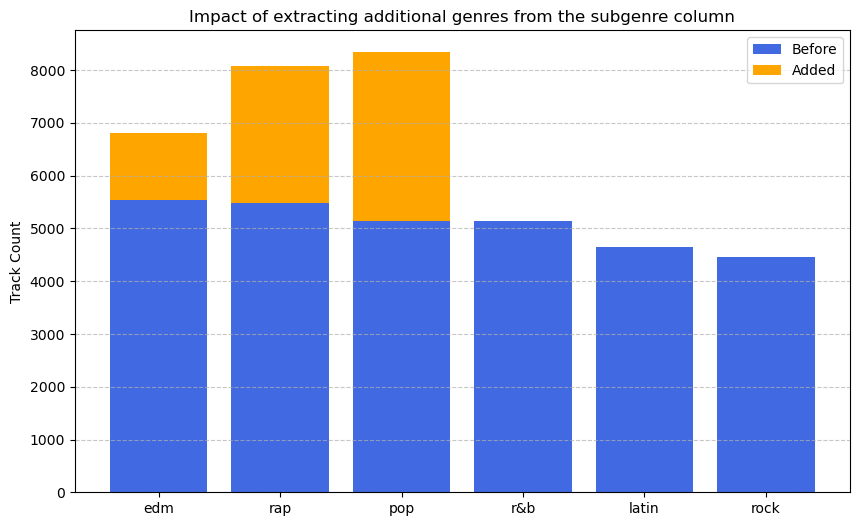
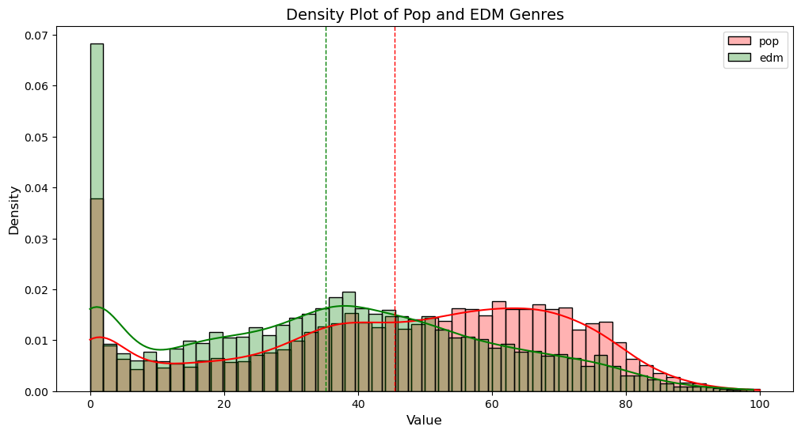

# Spotit - Where Data Meets Music

## Introduction - Project Goals

This project aims to identify the key factors that influence a song’s popularity on Spotify. Specifically, **we aim to predict a track's popularity score** based on its general attributes, such as release year, genre, artist etc., as well as its technical features, like tempo, acousticness, loudness, and other audio characteristics.

### How Does It Work?

Using the [Spotify Songs Dataset](https://www.kaggle.com/datasets/joebeachcapital/30000-spotify-songs?select=spotify_songs.csv), which contains data extracted from the Spotify API, we trained a machine learning model to predict a track's popularity based on its features.

However, we did not rely solely on raw data for model training. This document summarizes the techniques we employed to process and enhance the data for optimal model performance:

* **Data Cleaning**: Outliers, missing values, and duplicate entries were addressed to create a reliable dataset.
* **Feature Engineering**: We analyzed trends and correlations between track popularity and its features, generating new insights and additional data columns.
* **Feature Selection**: To prevent overfitting, we carefully selected the most relevant features for model training.
* **Model Evaluation**: Various regression models were tested, and their performance was compared using multiple metrics. Hyperparameter tuning was conducted to optimize the chosen model.

[Insert image created by Orange Data Mining]

### Potential Users of This Model

This system offers value to multiple stakeholders in the music industry, including:

* **Artists & Producers**: Gain insights to optimize song characteristics for better audience engagement.
* **Record Labels & Marketers**: Use predictions to inform promotional strategies and identify tracks with high potential.
* **Streaming Platforms**: Enhance recommendation algorithms by incorporating predicted popularity scores.

#### Model Deployment

The machine learning model will be deployed as a web-based application using frameworks such as [Streamlit](https://streamlit.io/) or [Flask](https://flask.palletsprojects.com/en/stable/). Users will be able to input song attributes and receive a predicted popularity score.

Additionally, the model can be integrated into existing analytics platforms for music producers, record labels, and streaming services. Deployment options include cloud-based hosting solutions (e.g., AWS, Google Cloud, or Azure) to ensure scalability and global accessibility.

### Project Overview

This document provides an overview of the project, summarizing each step and highlighting key insights:

1. **Data Preparation**: Details the preprocessing steps applied to the raw Kaggle dataset.
2. **Exploratory Data Analysis (EDA)**: Explores trends and correlations using visualizations and statistical tests.
3. **Data Cleaning**: Describes the removal of outliers and handling of missing values to improve data reliability.
4. **Feature Engineering**: Explains the creation of additional features to enhance model performance.
5. **Feature Selection**: Highlights the use of regularization methods and feature importance techniques to avoid overfitting.
6. **Model Selection**: Compares various regression models and describes the hyperparameter tuning process used to select the best-performing model.

---

## Data Preparation

### Dataset properties

The original dataset shape is 32833 rows X 23 columns.

We started the data preparation process by having a first impression of our dataset features. The features can be divided into two groups:

1. The track general attributes:

variable                 |class     |
|:---|:---|
|track_id                 |character |
|track_name               |character |
|track_artist             |character |
|track_popularity         |double    |
|track_album_id           |character |
|track_album_name         |character |
|track_album_release_date |character |
|playlist_name            |character |
|playlist_id              |character |
|playlist_genre           |character |
|playlist_subgenre        |character |

2. The track musical features:

variable                 |class     |
|:---|:---|
|danceability             |double    |
|energy                   |double    |
|key                      |double    |
|loudness                 |double    |
|mode                     |double    |
|speechiness              |double    |
|acousticness             |double    |
|instrumentalness         |double    |
|liveness                 |double    |
|valence                  |double    |
|tempo                    |double    |
|duration_ms              |double    |

We also found that there are **five** rows in total with **missing values**.

### `df_text`

We moved the rich-text columns `['track_name', 'track_album_name', 'playlist_name']` to a separate dataframe called `df_text`. We will use this data in the Feature Engineering step, but for now it stands in the way of creating a flat file

### Duplicate tracks and handling playlist features

We found *3166* tracks that appears two times or more in the dataset.

A short look at the duplicated tracks rows showed us that even though we filtered for duplicated `track_id` values, all `track_*` and `album_*` values are duplicated as well for the same `track_id` (and the track musical properties).

The differences are in the `playlist` features - the same track may appear in different playlists - creating duplicate entries for the track. But since we are predicting the **track** popularity, we have no need to know about the details about the playlist features.

So we did a few changes: we created a new column `playlist_count` for each track, and dropped the genre columns by replacing them with one-hot encoding for each genre. We enhanced this process by taking into the account the sub-genres as well, classifying each subgenre to a corresponding main genre gave us extra data, as can be seen below:

## Explanatory Data Analysis

The EDA started with creating the **Data Protocol**. The Data Protocol is used for project documentation and knowledge-preservation. It can be used like a pocket guide to the dataset description. It can be found [here](data/02_exploratory_data_analysis).

Then we moved on to creating data-relations reports automatically using AutoViz.

Regardless of the the visual insights, applying descriptive statistics tools such as Skewness, ANOVA, correlations etc. to learn more about the data and its internal relations.

Below is one of the EDA highlights, a visualization for an ANOVA test checking for a significant differences in track popularity variances between two main genres, Pop and EDM:

## Data Cleansing

