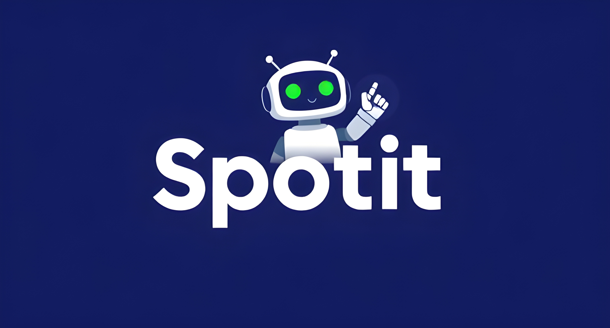

# Spotit - Where Data Meets Music

## Introduction - Project Goals

This project aims to identify the key factors that influence a song’s popularity on Spotify. Specifically, **we aim to predict a track's popularity score** based on its general attributes, such as release year, genre, artist etc., as well as its technical features, like tempo, acousticness, loudness, and other audio characteristics.

### How Does It Work?

Using the [Spotify Songs Dataset](https://www.kaggle.com/datasets/joebeachcapital/30000-spotify-songs?select=spotify_songs.csv), which contains data extracted from the Spotify API, we trained a machine learning model to predict a track's popularity based on its features.

However, we did not rely solely on raw data for model training. This document summarizes the techniques we employed to process and enhance the data for optimal model performance:

* **Data Cleaning**: Outliers, missing values, and duplicate entries were addressed to create a reliable dataset.
* **Feature Engineering**: We analyzed trends and correlations between track popularity and its features, generating new insights and additional data columns.
* **Feature Selection**: To prevent overfitting, we carefully selected the most relevant features for model training.
* **Model Evaluation**: Various regression models were tested, and their performance was compared using multiple metrics. Hyperparameter tuning was conducted to optimize the chosen model.

[Insert image created by Orange Data Mining]

### Potential Users of This Model

This system offers value to multiple stakeholders in the music industry, including:

* **Artists & Producers**: Gain insights to optimize song characteristics for better audience engagement.
* **Record Labels & Marketers**: Use predictions to inform promotional strategies and identify tracks with high potential.
* **Streaming Platforms**: Enhance recommendation algorithms by incorporating predicted popularity scores.

#### Model Deployment

The machine learning model will be deployed as a web-based application using frameworks such as [Streamlit](https://streamlit.io/) or [Flask](https://flask.palletsprojects.com/en/stable/). Users will be able to input song attributes and receive a predicted popularity score.

Additionally, the model can be integrated into existing analytics platforms for music producers, record labels, and streaming services. Deployment options include cloud-based hosting solutions (e.g., AWS, Google Cloud, or Azure) to ensure scalability and global accessibility.

### Project Overview

This document provides an overview of the project, summarizing each step and highlighting key insights:

1. **Data Preparation**: Details the preprocessing steps applied to the raw Kaggle dataset.
2. **Exploratory Data Analysis (EDA)**: Explores trends and correlations using visualizations and statistical tests.
3. **Data Cleaning**: Describes the removal of outliers and handling of missing values to improve data reliability.
4. **Feature Engineering**: Explains the creation of additional features to enhance model performance.
5. **Feature Selection**: Highlights the use of regularization methods and feature importance techniques to avoid overfitting.
6. **Model Selection**: Compares various regression models and describes the hyperparameter tuning process used to select the best-performing model.

---
