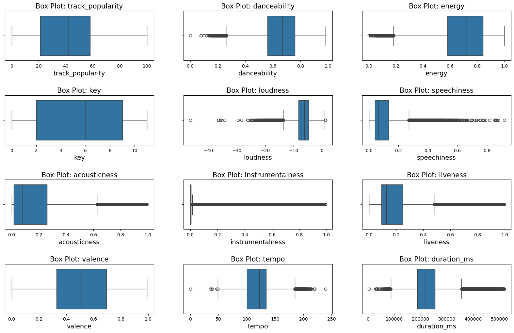
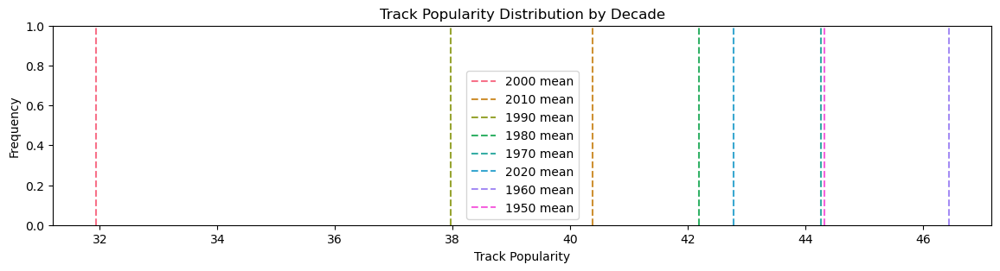

# Spotit - Where Data Meets Music

## Introduction - Project Goals

This project aims to identify the key factors that influence a song’s popularity on Spotify. Specifically, **we aim to predict a track's popularity score** based on its general attributes, such as release year, genre, artist etc., as well as its technical features, like tempo, acousticness, loudness, and other audio characteristics.

### How Does It Work?

Using the [Spotify Songs Dataset](https://www.kaggle.com/datasets/joebeachcapital/30000-spotify-songs?select=spotify_songs.csv), which contains data extracted from the Spotify API, we trained a machine learning model to predict a track's popularity based on its features.

However, we did not rely solely on raw data for model training. This document summarizes the techniques we employed to process and enhance the data for optimal model performance:

* **Data Cleaning**: Outliers, missing values, and duplicate entries were addressed to create a reliable dataset.
* **Feature Engineering**: We analyzed trends and correlations between track popularity and its features, generating new insights and additional data columns.
* **Feature Selection**: To prevent overfitting, we carefully selected the most relevant features for model training.
* **Model Evaluation**: Various regression models were tested, and their performance was compared using multiple metrics. Hyperparameter tuning was conducted to optimize the chosen model.

[Insert image created by Orange Data Mining]

### Potential Users of This Model

This system offers value to multiple stakeholders in the music industry, including:

* **Artists & Producers**: Gain insights to optimize song characteristics for better audience engagement.
* **Record Labels & Marketers**: Use predictions to inform promotional strategies and identify tracks with high potential.
* **Streaming Platforms**: Enhance recommendation algorithms by incorporating predicted popularity scores.

#### Model Deployment

The machine learning model will be deployed as a web-based application using frameworks such as [Streamlit](https://streamlit.io/) or [Flask](https://flask.palletsprojects.com/en/stable/). Users will be able to input song attributes and receive a predicted popularity score.

Additionally, the model can be integrated into existing analytics platforms for music producers, record labels, and streaming services. Deployment options include cloud-based hosting solutions (e.g., AWS, Google Cloud, or Azure) to ensure scalability and global accessibility.

### Project Overview

This document provides an overview of the project, summarizing each step and highlighting key insights:

1. **Data Preparation**: Details the preprocessing steps applied to the raw Kaggle dataset.
2. **Exploratory Data Analysis (EDA)**: Explores trends and correlations using visualizations and statistical tests.
3. **Data Cleaning**: Describes the removal of outliers and handling of missing values to improve data reliability.
4. **Feature Engineering**: Explains the creation of additional features to enhance model performance.
5. **Feature Selection**: Highlights the use of regularization methods and feature importance techniques to avoid overfitting.
6. **Model Selection**: Compares various regression models and describes the hyperparameter tuning process used to select the best-performing model.

---

## Data Preparation

### Dataset Properties

The original dataset consists of **32,833 rows** and **23 columns**. 

To begin the data preparation process, we conducted an initial assessment of the dataset's features. These features can be categorized into two groups:

1. **Track General Attributes**:

| Variable                 | Data Type  |
|:-------------------------|:-----------|
| `track_id`               | Character  |
| `track_name`             | Character  |
| `track_artist`           | Character  |
| `track_popularity`       | Double     |
| `track_album_id`         | Character  |
| `track_album_name`       | Character  |
| `track_album_release_date` | Character |
| `playlist_name`          | Character  |
| `playlist_id`            | Character  |
| `playlist_genre`         | Character  |
| `playlist_subgenre`      | Character  |

2. **Track Musical Features**:

| Variable                 | Data Type  |
|:-------------------------|:-----------|
| `danceability`           | Double     |
| `energy`                 | Double     |
| `key`                    | Double     |
| `loudness`               | Double     |
| `mode`                   | Double     |
| `speechiness`            | Double     |
| `acousticness`           | Double     |
| `instrumentalness`       | Double     |
| `liveness`               | Double     |
| `valence`                | Double     |
| `tempo`                  | Double     |
| `duration_ms`            | Double     |

Additionally, we identified **five rows** containing **missing values**.

### Handling Rich-Text Columns

We extracted the rich-text columns `['track_name', 'track_album_name', 'playlist_name']` into a separate DataFrame, `df_text`. These columns will be utilized during the Feature Engineering phase. For now, they were excluded to simplify the creation of a flat dataset.

### Duplicate Tracks and Playlist Features

Our analysis revealed **3,166 duplicate tracks** in the dataset. These duplicates were identified based on the `track_id` column. Upon further inspection, we observed that all `track_*` and `album_*` attributes were identical for the same `track_id`, including the musical features. The differences were confined to the `playlist_*` attributes, as the same track appeared in multiple playlists.

Since our objective is to predict **track popularity**, playlist-specific details were deemed unnecessary. To address this, we implemented the following changes:

1. **Playlist Count**: Added a new column, `playlist_count`, to indicate the number of playlists in which a track appears.
2. **Genre Encoding**: Replaced the `playlist_genre` and `playlist_subgenre` columns with one-hot encoded features for each main genre. Subgenres were mapped to their corresponding main genres, guaranteeing no data is being thrown due to the genre encoding.

Below is a bar plot showing the genre distribution, including the subgenre mapping impact on the process:

## Exploratory Data Analysis (EDA)

The EDA phase began with the creation of a **Data Protocol**, a comprehensive document summarizing the dataset's structure and attributes. This protocol serves as a reference guide for project documentation and knowledge preservation. It is available [here](data/02_exploratory_data_analysis) (accessible within the GitHub repository).

We then generated automated data-relation reports using **AutoViz** to uncover trends and correlations.

### Descriptive Statistics

In addition to visual insights, we applied statistical methods such as skewness analysis, ANOVA, and correlation matrices to gain a deeper understanding of the data. Below is a highlight from our EDA: an ANOVA test examining significant differences in track popularity variances between two main genres, Pop and EDM:

## Data Cleansing

The data cleansing process involved two primary steps:

1. **Outlier Detection**: Identifying and handling outliers using statistical methods.
2. **Missing Data Imputation**: Filling missing values using advanced techniques.

### Outlier Detection

We employed the **Interquartile Range (IQR)** method to detect outliers. The IQR is calculated as:

$IQR = Q3 - Q1$

Values outside the lower and upper bounds derived from the IQR were flagged as outliers and set to `Null`. Below is a visualization of the outlier detection process:

### Missing Data Imputation

To address missing values, including those introduced during outlier detection, we utilized **MICE (Multiple Imputation by Chained Equations)**. This technique leverages regression models to predict missing values, making it particularly effective for continuous data. Features with strong correlations were used as predictors for imputation.

The results of the imputation process are illustrated below:

- **Gray**: Original data distribution.
- **Blue**: Data points within the IQR.
- **Yellow**: Imputed data points.

## Feature Engineering

In this step, we applied advanced feature enrichment techniques to enhance the dataset. These new features aim to provide the model with additional, meaningful information, potentially improving its predictive performance.

The newly engineered features can be categorized into three groups:

### Parsing the `track_album_release_date` column into meaningful features

1. A standard feature engineering approach involves splitting a datetime field into `Year`, `Month`, and `Day` components.
2. Since we are working with music, categorizing tracks by **decades** can provide valuable insights. To achieve this, we created a new `decade` column.

Below is a visualization of an ANOVA test examining variance differences in popularity across decades:

As shown, the means vary significantly between decades, supporting the inclusion of the `decade` column.

3. The advent of the internet and the rise of streaming platforms have transformed how music is consumed, potentially influencing popularity trends. To capture this, we added a binary column indicating whether a track was released during the "internet era" - which we determined to start at 2008, Spotify launch year.

### Analyzing the `track_name` Textual Column

During the data preparation phase, we extracted free-text columns into a separate DataFrame, `df_text`. Now, we leverage this data for feature engineering.

Using **WordCloud**, we analyzed the most frequently mentioned words in the `track_name` column. Based on this analysis, we created binary (dummy) columns to indicate whether a track's name contains any of the top five most common words.

The five most frequent words were: `feat`, `Remix`, `Love`, `Radio Edit`, and `Remastered`. While not particularly surprising, these terms reflect common naming conventions in the music industry.

### Incorporating artist popularity

The original dataset lacked a unique identifier for artists, providing only their names as strings. This posed a challenge, as encoding artist names would not yield meaningful insights due to the high cardinality (over 10,000 unique values). Additionally, raw text processing of artist names would not benefit the model.

To address this, we enriched the dataset by replacing the `track_artist` column with a new feature: the number of followers for each artist. This information was sourced from an external dataset, significantly enhancing the dataset's utility for predictive modeling.

