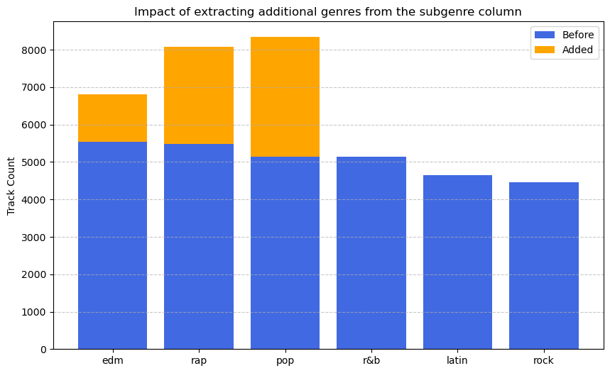

# Data Preparation


```python
# DS18 ML Essentials project
# Module 1: Data Preparation

# Submitted by: Tzvi Eliezer Nir
# mail: tzvienir@gmail.com
# First submission: 05/03/2025

# Last modification: 08/03/2025
# (fixing submission feedback given in 05/03 class)
```

## First Impression

In this section we will load the dataset and see its basic structure: columns characteristics, shape, nulls, duplicates etc.

The reasons we do this simple analysis now is to find where the data needs some preprocessing done - merging tables, handling textual and categorical columns and more.

We will NOT however do any visual or computational EDA since this section is about preparing the dataset **to** the EDA.

### Load the dataset


```python
import pandas as pd
```


```python
df = pd.read_csv('data/spotify_songs.csv')

df.head()
```


<div>
<style scoped>
    .dataframe tbody tr th:only-of-type {
        vertical-align: middle;
    }

    .dataframe tbody tr th {
        vertical-align: top;
    }

    .dataframe thead th {
        text-align: right;
    }
</style>
<table border="1" class="dataframe">
  <thead>
    <tr style="text-align: right;">
      <th></th>
      <th>track_id</th>
      <th>track_name</th>
      <th>track_artist</th>
      <th>track_popularity</th>
      <th>track_album_id</th>
      <th>track_album_name</th>
      <th>track_album_release_date</th>
      <th>playlist_name</th>
      <th>playlist_id</th>
      <th>playlist_genre</th>
      <th>...</th>
      <th>key</th>
      <th>loudness</th>
      <th>mode</th>
      <th>speechiness</th>
      <th>acousticness</th>
      <th>instrumentalness</th>
      <th>liveness</th>
      <th>valence</th>
      <th>tempo</th>
      <th>duration_ms</th>
    </tr>
  </thead>
  <tbody>
    <tr>
      <th>0</th>
      <td>6f807x0ima9a1j3VPbc7VN</td>
      <td>I Don't Care (with Justin Bieber) - Loud Luxur...</td>
      <td>Ed Sheeran</td>
      <td>66</td>
      <td>2oCs0DGTsRO98Gh5ZSl2Cx</td>
      <td>I Don't Care (with Justin Bieber) [Loud Luxury...</td>
      <td>2019-06-14</td>
      <td>Pop Remix</td>
      <td>37i9dQZF1DXcZDD7cfEKhW</td>
      <td>pop</td>
      <td>...</td>
      <td>6</td>
      <td>-2.634</td>
      <td>1</td>
      <td>0.0583</td>
      <td>0.1020</td>
      <td>0.000000</td>
      <td>0.0653</td>
      <td>0.518</td>
      <td>122.036</td>
      <td>194754</td>
    </tr>
    <tr>
      <th>1</th>
      <td>0r7CVbZTWZgbTCYdfa2P31</td>
      <td>Memories - Dillon Francis Remix</td>
      <td>Maroon 5</td>
      <td>67</td>
      <td>63rPSO264uRjW1X5E6cWv6</td>
      <td>Memories (Dillon Francis Remix)</td>
      <td>2019-12-13</td>
      <td>Pop Remix</td>
      <td>37i9dQZF1DXcZDD7cfEKhW</td>
      <td>pop</td>
      <td>...</td>
      <td>11</td>
      <td>-4.969</td>
      <td>1</td>
      <td>0.0373</td>
      <td>0.0724</td>
      <td>0.004210</td>
      <td>0.3570</td>
      <td>0.693</td>
      <td>99.972</td>
      <td>162600</td>
    </tr>
    <tr>
      <th>2</th>
      <td>1z1Hg7Vb0AhHDiEmnDE79l</td>
      <td>All the Time - Don Diablo Remix</td>
      <td>Zara Larsson</td>
      <td>70</td>
      <td>1HoSmj2eLcsrR0vE9gThr4</td>
      <td>All the Time (Don Diablo Remix)</td>
      <td>2019-07-05</td>
      <td>Pop Remix</td>
      <td>37i9dQZF1DXcZDD7cfEKhW</td>
      <td>pop</td>
      <td>...</td>
      <td>1</td>
      <td>-3.432</td>
      <td>0</td>
      <td>0.0742</td>
      <td>0.0794</td>
      <td>0.000023</td>
      <td>0.1100</td>
      <td>0.613</td>
      <td>124.008</td>
      <td>176616</td>
    </tr>
    <tr>
      <th>3</th>
      <td>75FpbthrwQmzHlBJLuGdC7</td>
      <td>Call You Mine - Keanu Silva Remix</td>
      <td>The Chainsmokers</td>
      <td>60</td>
      <td>1nqYsOef1yKKuGOVchbsk6</td>
      <td>Call You Mine - The Remixes</td>
      <td>2019-07-19</td>
      <td>Pop Remix</td>
      <td>37i9dQZF1DXcZDD7cfEKhW</td>
      <td>pop</td>
      <td>...</td>
      <td>7</td>
      <td>-3.778</td>
      <td>1</td>
      <td>0.1020</td>
      <td>0.0287</td>
      <td>0.000009</td>
      <td>0.2040</td>
      <td>0.277</td>
      <td>121.956</td>
      <td>169093</td>
    </tr>
    <tr>
      <th>4</th>
      <td>1e8PAfcKUYoKkxPhrHqw4x</td>
      <td>Someone You Loved - Future Humans Remix</td>
      <td>Lewis Capaldi</td>
      <td>69</td>
      <td>7m7vv9wlQ4i0LFuJiE2zsQ</td>
      <td>Someone You Loved (Future Humans Remix)</td>
      <td>2019-03-05</td>
      <td>Pop Remix</td>
      <td>37i9dQZF1DXcZDD7cfEKhW</td>
      <td>pop</td>
      <td>...</td>
      <td>1</td>
      <td>-4.672</td>
      <td>1</td>
      <td>0.0359</td>
      <td>0.0803</td>
      <td>0.000000</td>
      <td>0.0833</td>
      <td>0.725</td>
      <td>123.976</td>
      <td>189052</td>
    </tr>
  </tbody>
</table>
<p>5 rows × 23 columns</p>
</div>


### Dataset properties

Lets have a look at the dataset shape and the type of each column using `df.shape()`,`df.info()`:


```python
df.shape
```


    (32833, 23)


```python
df.info()
```

    <class 'pandas.core.frame.DataFrame'>
    RangeIndex: 32833 entries, 0 to 32832
    Data columns (total 23 columns):
     #   Column                    Non-Null Count  Dtype  
    ---  ------                    --------------  -----  
     0   track_id                  32833 non-null  object 
     1   track_name                32828 non-null  object 
     2   track_artist              32828 non-null  object 
     3   track_popularity          32833 non-null  int64  
     4   track_album_id            32833 non-null  object 
     5   track_album_name          32828 non-null  object 
     6   track_album_release_date  32833 non-null  object 
     7   playlist_name             32833 non-null  object 
     8   playlist_id               32833 non-null  object 
     9   playlist_genre            32833 non-null  object 
     10  playlist_subgenre         32833 non-null  object 
     11  danceability              32833 non-null  float64
     12  energy                    32833 non-null  float64
     13  key                       32833 non-null  int64  
     14  loudness                  32833 non-null  float64
     15  mode                      32833 non-null  int64  
     16  speechiness               32833 non-null  float64
     17  acousticness              32833 non-null  float64
     18  instrumentalness          32833 non-null  float64
     19  liveness                  32833 non-null  float64
     20  valence                   32833 non-null  float64
     21  tempo                     32833 non-null  float64
     22  duration_ms               32833 non-null  int64  
    dtypes: float64(9), int64(4), object(10)
    memory usage: 5.8+ MB


As we can see, There is a significant amount of `object`-type columns which we will have to handle.

Yet, there are plenty of numerical columns both `int` and `float`. Lets have a look at the values of this columns using `df.describe()`:


```python
df.describe().T
```


<div>
<style scoped>
    .dataframe tbody tr th:only-of-type {
        vertical-align: middle;
    }

    .dataframe tbody tr th {
        vertical-align: top;
    }

    .dataframe thead th {
        text-align: right;
    }
</style>
<table border="1" class="dataframe">
  <thead>
    <tr style="text-align: right;">
      <th></th>
      <th>count</th>
      <th>mean</th>
      <th>std</th>
      <th>min</th>
      <th>25%</th>
      <th>50%</th>
      <th>75%</th>
      <th>max</th>
    </tr>
  </thead>
  <tbody>
    <tr>
      <th>track_popularity</th>
      <td>32833.0</td>
      <td>42.477081</td>
      <td>24.984074</td>
      <td>0.000000</td>
      <td>24.0000</td>
      <td>45.000000</td>
      <td>62.00000</td>
      <td>100.000</td>
    </tr>
    <tr>
      <th>danceability</th>
      <td>32833.0</td>
      <td>0.654850</td>
      <td>0.145085</td>
      <td>0.000000</td>
      <td>0.5630</td>
      <td>0.672000</td>
      <td>0.76100</td>
      <td>0.983</td>
    </tr>
    <tr>
      <th>energy</th>
      <td>32833.0</td>
      <td>0.698619</td>
      <td>0.180910</td>
      <td>0.000175</td>
      <td>0.5810</td>
      <td>0.721000</td>
      <td>0.84000</td>
      <td>1.000</td>
    </tr>
    <tr>
      <th>key</th>
      <td>32833.0</td>
      <td>5.374471</td>
      <td>3.611657</td>
      <td>0.000000</td>
      <td>2.0000</td>
      <td>6.000000</td>
      <td>9.00000</td>
      <td>11.000</td>
    </tr>
    <tr>
      <th>loudness</th>
      <td>32833.0</td>
      <td>-6.719499</td>
      <td>2.988436</td>
      <td>-46.448000</td>
      <td>-8.1710</td>
      <td>-6.166000</td>
      <td>-4.64500</td>
      <td>1.275</td>
    </tr>
    <tr>
      <th>mode</th>
      <td>32833.0</td>
      <td>0.565711</td>
      <td>0.495671</td>
      <td>0.000000</td>
      <td>0.0000</td>
      <td>1.000000</td>
      <td>1.00000</td>
      <td>1.000</td>
    </tr>
    <tr>
      <th>speechiness</th>
      <td>32833.0</td>
      <td>0.107068</td>
      <td>0.101314</td>
      <td>0.000000</td>
      <td>0.0410</td>
      <td>0.062500</td>
      <td>0.13200</td>
      <td>0.918</td>
    </tr>
    <tr>
      <th>acousticness</th>
      <td>32833.0</td>
      <td>0.175334</td>
      <td>0.219633</td>
      <td>0.000000</td>
      <td>0.0151</td>
      <td>0.080400</td>
      <td>0.25500</td>
      <td>0.994</td>
    </tr>
    <tr>
      <th>instrumentalness</th>
      <td>32833.0</td>
      <td>0.084747</td>
      <td>0.224230</td>
      <td>0.000000</td>
      <td>0.0000</td>
      <td>0.000016</td>
      <td>0.00483</td>
      <td>0.994</td>
    </tr>
    <tr>
      <th>liveness</th>
      <td>32833.0</td>
      <td>0.190176</td>
      <td>0.154317</td>
      <td>0.000000</td>
      <td>0.0927</td>
      <td>0.127000</td>
      <td>0.24800</td>
      <td>0.996</td>
    </tr>
    <tr>
      <th>valence</th>
      <td>32833.0</td>
      <td>0.510561</td>
      <td>0.233146</td>
      <td>0.000000</td>
      <td>0.3310</td>
      <td>0.512000</td>
      <td>0.69300</td>
      <td>0.991</td>
    </tr>
    <tr>
      <th>tempo</th>
      <td>32833.0</td>
      <td>120.881132</td>
      <td>26.903624</td>
      <td>0.000000</td>
      <td>99.9600</td>
      <td>121.984000</td>
      <td>133.91800</td>
      <td>239.440</td>
    </tr>
    <tr>
      <th>duration_ms</th>
      <td>32833.0</td>
      <td>225799.811622</td>
      <td>59834.006182</td>
      <td>4000.000000</td>
      <td>187819.0000</td>
      <td>216000.000000</td>
      <td>253585.00000</td>
      <td>517810.000</td>
    </tr>
  </tbody>
</table>
</div>


From the look of it, each of the numerical columns has a meaningful data with its own distribution.

### Looking for missing values

Lets see if there are any missing values:


```python
# Check for missing values
print(df.isnull().sum())  # Shows count of NaNs per column
```

    track_id                    0
    track_name                  5
    track_artist                5
    track_popularity            0
    track_album_id              0
    track_album_name            5
    track_album_release_date    0
    playlist_name               0
    playlist_id                 0
    playlist_genre              0
    playlist_subgenre           0
    danceability                0
    energy                      0
    key                         0
    loudness                    0
    mode                        0
    speechiness                 0
    acousticness                0
    instrumentalness            0
    liveness                    0
    valence                     0
    tempo                       0
    duration_ms                 0
    dtype: int64


As we can see there are 5 missing cells in multiple columns. Luckily enough those 5 values belongs to the same rows - if we try to find all rows with missing cells we get **5** rows in total:


```python
missing_rows = df[df.isna().any(axis=1)]
missing_rows
```


<div>
<style scoped>
    .dataframe tbody tr th:only-of-type {
        vertical-align: middle;
    }

    .dataframe tbody tr th {
        vertical-align: top;
    }

    .dataframe thead th {
        text-align: right;
    }
</style>
<table border="1" class="dataframe">
  <thead>
    <tr style="text-align: right;">
      <th></th>
      <th>track_id</th>
      <th>track_name</th>
      <th>track_artist</th>
      <th>track_popularity</th>
      <th>track_album_id</th>
      <th>track_album_name</th>
      <th>track_album_release_date</th>
      <th>playlist_name</th>
      <th>playlist_id</th>
      <th>playlist_genre</th>
      <th>...</th>
      <th>key</th>
      <th>loudness</th>
      <th>mode</th>
      <th>speechiness</th>
      <th>acousticness</th>
      <th>instrumentalness</th>
      <th>liveness</th>
      <th>valence</th>
      <th>tempo</th>
      <th>duration_ms</th>
    </tr>
  </thead>
  <tbody>
    <tr>
      <th>8151</th>
      <td>69gRFGOWY9OMpFJgFol1u0</td>
      <td>NaN</td>
      <td>NaN</td>
      <td>0</td>
      <td>717UG2du6utFe7CdmpuUe3</td>
      <td>NaN</td>
      <td>2012-01-05</td>
      <td>HIP&amp;HOP</td>
      <td>5DyJsJZOpMJh34WvUrQzMV</td>
      <td>rap</td>
      <td>...</td>
      <td>6</td>
      <td>-7.635</td>
      <td>1</td>
      <td>0.1760</td>
      <td>0.0410</td>
      <td>0.00000</td>
      <td>0.1160</td>
      <td>0.649</td>
      <td>95.999</td>
      <td>282707</td>
    </tr>
    <tr>
      <th>9282</th>
      <td>5cjecvX0CmC9gK0Laf5EMQ</td>
      <td>NaN</td>
      <td>NaN</td>
      <td>0</td>
      <td>3luHJEPw434tvNbme3SP8M</td>
      <td>NaN</td>
      <td>2017-12-01</td>
      <td>GANGSTA Rap</td>
      <td>5GA8GDo7RQC3JEanT81B3g</td>
      <td>rap</td>
      <td>...</td>
      <td>11</td>
      <td>-5.364</td>
      <td>0</td>
      <td>0.3190</td>
      <td>0.0534</td>
      <td>0.00000</td>
      <td>0.5530</td>
      <td>0.191</td>
      <td>146.153</td>
      <td>202235</td>
    </tr>
    <tr>
      <th>9283</th>
      <td>5TTzhRSWQS4Yu8xTgAuq6D</td>
      <td>NaN</td>
      <td>NaN</td>
      <td>0</td>
      <td>3luHJEPw434tvNbme3SP8M</td>
      <td>NaN</td>
      <td>2017-12-01</td>
      <td>GANGSTA Rap</td>
      <td>5GA8GDo7RQC3JEanT81B3g</td>
      <td>rap</td>
      <td>...</td>
      <td>10</td>
      <td>-5.907</td>
      <td>0</td>
      <td>0.3070</td>
      <td>0.0963</td>
      <td>0.00000</td>
      <td>0.0888</td>
      <td>0.505</td>
      <td>86.839</td>
      <td>206465</td>
    </tr>
    <tr>
      <th>19568</th>
      <td>3VKFip3OdAvv4OfNTgFWeQ</td>
      <td>NaN</td>
      <td>NaN</td>
      <td>0</td>
      <td>717UG2du6utFe7CdmpuUe3</td>
      <td>NaN</td>
      <td>2012-01-05</td>
      <td>Reggaeton viejito🔥</td>
      <td>0si5tw70PIgPkY1Eva6V8f</td>
      <td>latin</td>
      <td>...</td>
      <td>11</td>
      <td>-6.075</td>
      <td>0</td>
      <td>0.0366</td>
      <td>0.0606</td>
      <td>0.00653</td>
      <td>0.1030</td>
      <td>0.726</td>
      <td>97.017</td>
      <td>252773</td>
    </tr>
    <tr>
      <th>19811</th>
      <td>69gRFGOWY9OMpFJgFol1u0</td>
      <td>NaN</td>
      <td>NaN</td>
      <td>0</td>
      <td>717UG2du6utFe7CdmpuUe3</td>
      <td>NaN</td>
      <td>2012-01-05</td>
      <td>latin hip hop</td>
      <td>3nH8aytdqNeRbcRCg3dw9q</td>
      <td>latin</td>
      <td>...</td>
      <td>6</td>
      <td>-7.635</td>
      <td>1</td>
      <td>0.1760</td>
      <td>0.0410</td>
      <td>0.00000</td>
      <td>0.1160</td>
      <td>0.649</td>
      <td>95.999</td>
      <td>282707</td>
    </tr>
  </tbody>
</table>
<p>5 rows × 23 columns</p>
</div>


#### Handling missing values

Although there are good arguments to drop those rows now (missing crucial values, 0 popularity) the time for handling missing data will come in the **next** module. For now, this track identifiers, genres, popularity - useful data for ML models - so it stays.

### Find duplicate tracks

To avoid giving a single track more weight than the others, we want to find duplicated instances of the same track and make sure only one stays after the preparation.

First lets find if there are any duplicated values, comparing `df` shape to number of unique `track_id` values:


```python
print(f"There are {df.shape[0]} rows in the dataset")
print(f"There are {df['track_id'].nunique()} unique tracks in the dataset")
```

    There are 32833 rows in the dataset
    There are 28356 unique tracks in the dataset


Having this gap means that there are indeed duplicate tracks. IT DOES NOT MEAN that the number of duplicated tracks is about 4K (32K-28K) - as we will see shortly.

For now let just find the duplicated tracks without throwing them, since there is still data to extract from the duplicated rows.

We will filter the dataset using `df.duplicated`:


```python
# Identify duplicate track_id values
duplicates = df[df.duplicated(subset=["track_id"], keep=False)]

# Sort by track_id
duplicates_sorted = duplicates.sort_values(by="track_id")

# Save the sorted duplicates to a new CSV file (optional)
duplicates_sorted.to_csv("data/01_data_preparation/duplicate_tracks_sorted.csv", index=False)

# Display the sorted duplicate rows
duplicates_sorted["track_id"].nunique()
```


    3166


#### Examining the duplicate values

There are **3166** tracks that appears two times or more in the dataset.

A short look at the `duplicated` dataframe will show us that even though we filtered for duplicated `track_id` values, all `track_*` and `album_*` values are duplicated as well for the same `track_id` (and the track musical properties).

The differences are in the `playlist` features - the same track may appear in different playlists - creating duplicate entries for the track.

This is important, because it means all we need to do to "merge" the duplicated entries is to handle just the few `playlist` features.

## Clean Text

In this section we will remove free-text categories to a separate `df_text` dataframe.
This is crucial for the `playlist_name` column as its value may contain Emojis and other wildcard characters, but it is also useful to deal with `track_name` and `album_name`, and since those names are uniquely belongs to an ID we aren't loosing this data - we can always join back the tables based on the ID!


```python
df_text = df[['track_id', 'track_name', 'track_album_name', 'playlist_name']].copy()
df = df.drop(columns=['track_name', 'track_album_name', 'playlist_name'])
```

After some thought, I have decided to keep `track_artist`. I decided to take this approach since there is **no** "`artist_id`" column that I keep while throwing the artist name - **im loosing data**, and it is to early for that since in the *EDA & feature engineering* module we might find something useful

We may or may not use the `df_text` features in the future, but it is important to have a simple way to import them if we do. So lets export those values to both `.pkl` and `.csv` files:


```python
df_text.to_pickle("./pickle/01_data_preparation/df_text.pkl")
df_text.to_csv("./data/01_data_preparation/df_text.csv")
```

## Drop `playlist_id`

Since we are predicting the **track** popularity, we have no need to know about the playlist.

Sure, we will extract useful data like genre from the playlist properties, but when it comes to playlist name or ID - those values are not giving us any value to the question at hand (track popularity).

And yet, while the ID is not interesting, counting the appearances of each track in the provided playlists may be useful and predict popularity.

Lets add a column for number of playlist appearances:


```python
df["playlist_count"] = df.groupby("track_id")["track_id"].transform("count")
```

Now we can drop the playlist ID from the `df`:


```python
df = df.drop(columns=['playlist_id'])
```

## Genre encoding

### Motivation

After handling the `playlist_name` and `playlist_genre` column, all that left to deal with are the genres columns - and we can start merging the duplicated rows!

Tracks appears in multiple playlists, usually have multiple associated genres - one from each playlist. By encoding the genres we will get replace the `playlist_genre` column with encoded columns that will make it possible to merge the rows without loosing data.

### Genres overview

There are two genres columns - `playlist_genre` and `playlist_subgenre`. First lets get some idea on the data stored in those columns:


```python
genre_counts = df['playlist_genre'].value_counts()
subgenre_counts = df['playlist_subgenre'].value_counts()

print("Playlist Genre Counts:")
display(genre_counts)
print(f"There are {len(genre_counts)} MAIN genres") # 6

print("\nPlaylist Subgenre Counts:")
display(subgenre_counts)
print(f"There are {len(subgenre_counts)} SUB genres") # 24
```

    Playlist Genre Counts:


    playlist_genre
    edm      6043
    rap      5746
    pop      5507
    r&b      5431
    latin    5155
    rock     4951
    Name: count, dtype: int64


    There are 6 MAIN genres
    
    Playlist Subgenre Counts:


    playlist_subgenre
    progressive electro house    1809
    southern hip hop             1675
    indie poptimism              1672
    latin hip hop                1656
    neo soul                     1637
    pop edm                      1517
    electro house                1511
    hard rock                    1485
    gangster rap                 1458
    electropop                   1408
    urban contemporary           1405
    hip hop                      1322
    dance pop                    1298
    classic rock                 1296
    trap                         1291
    tropical                     1288
    latin pop                    1262
    hip pop                      1256
    big room                     1206
    new jack swing               1133
    post-teen pop                1129
    permanent wave               1105
    album rock                   1065
    reggaeton                     949
    Name: count, dtype: int64


    There are 24 SUB genres


### Strategy

There are six main genres, and 24 subgenres.

We are going to do the encoding in **two phases**:

1. We will use dummy encoding for the six main genres-
   we will create six new binary categories, each represents whether or not
   the track belongs to the genre.

   Duplicate tracks with different `playlist_genre` will be set to `1` in all associated genres.

2. We will not just throw the sub genres as we might find some usable information in there.
   
   For example, if a track has a main genre `rap` but a sub-genre **`hip pop`** (not **`hip hop`**!)
   we can use this information to associate the track with the `pop` genre as well (the `pop` dummy category will be `1`).

3. I will create a simple report to show how much the second phase changed the data.

### Encoding Genres

Lets start with the dummy-encoding of each genre:


```python
# Perform one-hot encoding
df_genre_encoded = pd.get_dummies(df['playlist_genre'], dtype=int)

# Merge with original dataframe
df = pd.concat([df, df_genre_encoded], axis=1)

# Drop the original column
df = df.drop(columns=['playlist_genre'])

```

As mentioned earlier, I want to see how much the second encoding phase changed the data, so I will save the sum of "1" in each genre after the first phase.

To get a valid report, we need to aggregate the duplicate rows and count their "1" in each genre.
Since we didn't handle the subgenre yet, aggregating the original `df` will loose us some subgenre data - so we do this aggregation in a copied dataset.

Lets create the report:


```python
# Handle duplicate tracks by aggregating (assuming 'track_id' uniquely identifies tracks)
df_copy = df.groupby('track_id', as_index=False).max()

# Count the number of tracks where each genre dummy column is 1
genre_track_counts = df_copy[['edm', 'rap', 'pop', 'r&b', 'latin', 'rock']].sum().to_dict()

# Print the results
print(genre_track_counts)
```

    {'edm': 5537, 'rap': 5486, 'pop': 5132, 'r&b': 5138, 'latin': 4641, 'rock': 4451}


### Handling sub-genres

As mentioned before, the sub genre column can help us more genres the track is associated with. The `playlist_genre` column force each track to have a single genre, but a track with sub-genre `pop edm` undoubtedly belongs to both genres. And now after we have done dummy encoding we can set "1" to both genres - this is a some valuable data!

Below you can find a dictionary mapping a sub-genre to its main genres:


```python
subgenre_to_genre = {
    "progressive electro house": ["edm"],
    "southern hip hop": ["rap"],
    "indie poptimism": ["pop"],
    "latin hip hop": ["latin", "rap"],
    "neo soul": ["r&b"],
    "pop edm": ["pop", "edm"],
    "electro house": ["edm"],
    "hard rock": ["rock"],
    "gangster rap": ["rap"],
    "electropop": ["pop", "edm"],
    "urban contemporary": ["r&b"],
    "hip hop": ["rap"],
    "dance pop": ["pop"],
    "classic rock": ["rock"],
    "trap": ["rap"],
    "tropical": ["latin"],
    "latin pop": ["latin", "pop"],
    "hip pop": ["pop", "rap"],
    "big room": ["edm"],
    "new jack swing": ["r&b"],
    "post-teen pop": ["pop"],
    "permanent wave": ["rock"],
    "album rock": ["rock"],
    "reggaeton": ["latin"]
}
```

Now for each track we are going to make sure that **all** associated genre dummies are set to `1` based on the sub-genre mapping:


```python
# Ensure all tracks have the correct genre dummies based on their subgenre
for subgenre, main_genres in subgenre_to_genre.items():
    df.loc[df['playlist_subgenre'] == subgenre, main_genres] = 1
```

Next, we can finally aggregate the duplicated data!


```python
df = df.groupby('track_id', as_index=False).max()
```

Last, lets count the `1`'s in each genre after updating the dummy columns using the sub-genre data:


```python
# Count the number of tracks where each genre dummy column is 1
genre_subgenre_track_counts = df[['edm', 'rap', 'pop', 'r&b', 'latin', 'rock']].sum().to_dict()

# Print the results
print(genre_subgenre_track_counts)
```

    {'edm': 6808, 'rap': 8078, 'pop': 8339, 'r&b': 5138, 'latin': 4641, 'rock': 4451}


Lets show on a Bar Plot the amount of tracks in each genre before/after extracting additional genres from the sub-genres:

*(I know i promised no visual EDA, but this is more about visualizing the changes in the dataset, not the data itself, so forgive me this time...)*


```python
import matplotlib.pyplot as plt
import numpy as np

# Data
genres = ['edm', 'rap', 'pop', 'r&b', 'latin', 'rock']

# Convert to lists
before_values = np.array([genre_track_counts[g] for g in genres])
after_values = np.array([genre_subgenre_track_counts[g] for g in genres])

# Compute the difference (increase)
increase_values = after_values - before_values

# Plot
fig, ax = plt.subplots(figsize=(10, 6))

# Base bars (before modification)
ax.bar(genres, before_values, color='royalblue', label='Before')

# Stacked bars (increase after modification)
ax.bar(genres, increase_values, bottom=before_values, color='orange', label='Added')

# Labels and formatting
ax.set_ylabel("Track Count")
ax.set_title("Impact of extracting additional genres from the subgenre column")
ax.legend()
ax.grid(axis='y', linestyle='--', alpha=0.7)

# Show the plot
plt.show()

```


    

    


```python
df = df.drop(columns=['playlist_subgenre'])
```

## Album release date

An obvious yet important data preparation step is to convert dates stored as `object` (string) to type `datetime`. In our dataset the `track_album_release_date` column is a relevant case. Lets change this column to be type `datetime`:


```python
# Convert to datetime, handling cases with only a year
def convert_dates(date):
    if len(date) == 4:  # If it's just a year
        return pd.to_datetime(date + '-01-01')  # Assume January 1st as the default
    return pd.to_datetime(date, errors='coerce')  # Convert normally, setting invalid values to NaT

df['track_album_release_date'] = df['track_album_release_date'].apply(convert_dates)
```

The `def convert_dates()` is used for an edge case where the release date is just a 4-letter year notation, without day and month.

I set as a default for those cases that the date should be 01/01 of that particular year.

Notice how I didn't break down the `datetime` into separate year, month, day columns - as this will be considered feature engineering and we are still at the data preparation part of this project.

## Save as pickle and CSV

We finished the data preparation part! It is time to store the df as a pickle file for the next chapter :-)


```python
df.to_pickle('pickle/01_data_preparation/data_preparation.pkl')
```

Since `.pkl` files are large binary files, it is generally not recommended to store them in a git repository.

Since my project is being managed with git, I will create a `.csv` file which is large but at least textual, and this file will be part of the git repo:


```python
df.to_csv('data/01_data_preparation/data_preparation.csv')
```

## Summary


Lets summarize the main actions I took in the data preparation process:

1. Got a first impression of the dataset: shape, columns, looked for missing and duplicate values.
2. Moved textual columns to a separate `df_text` column.
3. Dropped `playlist_id` and instead count `playlist_count` appearances.
4. Encoded the `playlist_genre` into dummy columns and extracted additional genre association from `playlist_subgenre`
5. Converted `track_album_release_date` into a `datetime` type
6. Saved the result `df` as a pickle for future use, and also as CSV for git.

### Processed Dataset Overview

Lets look at the dataset characteristics after the data preparation process:


```python
display(df.shape)

df.info()
```


    (28356, 24)


    <class 'pandas.core.frame.DataFrame'>
    RangeIndex: 28356 entries, 0 to 28355
    Data columns (total 24 columns):
     #   Column                    Non-Null Count  Dtype         
    ---  ------                    --------------  -----         
     0   track_id                  28356 non-null  object        
     1   track_artist              28352 non-null  object        
     2   track_popularity          28356 non-null  int64         
     3   track_album_id            28356 non-null  object        
     4   track_album_release_date  28356 non-null  datetime64[ns]
     5   danceability              28356 non-null  float64       
     6   energy                    28356 non-null  float64       
     7   key                       28356 non-null  int64         
     8   loudness                  28356 non-null  float64       
     9   mode                      28356 non-null  int64         
     10  speechiness               28356 non-null  float64       
     11  acousticness              28356 non-null  float64       
     12  instrumentalness          28356 non-null  float64       
     13  liveness                  28356 non-null  float64       
     14  valence                   28356 non-null  float64       
     15  tempo                     28356 non-null  float64       
     16  duration_ms               28356 non-null  int64         
     17  playlist_count            28356 non-null  int64         
     18  edm                       28356 non-null  int64         
     19  latin                     28356 non-null  int64         
     20  pop                       28356 non-null  int64         
     21  r&b                       28356 non-null  int64         
     22  rap                       28356 non-null  int64         
     23  rock                      28356 non-null  int64         
    dtypes: datetime64[ns](1), float64(9), int64(11), object(3)
    memory usage: 5.2+ MB


